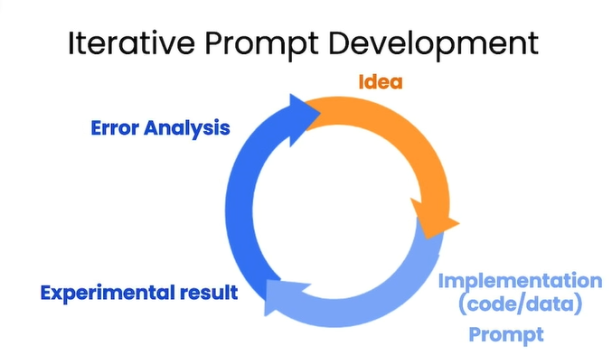

# Guidelines for Prompting

## Prompting Principles
* Principle 1: Write clear and specific instructions
* Principle 2: Give the model time to “think”

* check this as well: https://platform.openai.com/docs/guides/chat

## Tactics
* Tactic 1: Use delimiters to clearly indicate distinct parts of the input
* Tactic 2: Ask for a structured output
* Tactic 3: Ask the model to check whether conditions are satisfied
* Tactic 4: "Few-shot" prompting

## Principle 2: Give the model time to “think”
Tactic 1: Specify the steps required to complete a task
Tactic 2: Instruct the model to work out its own solution before rushing to a conclusion
Model Limitations: Hallucinations


```
To install the OpenAI Python library:

!pip install openai

The library needs to be configured with your account's secret key, which is available on the website.

You can either set it as the OPENAI_API_KEY environment variable before using the library:

 !export OPENAI_API_KEY='sk-...'

Or, set openai.api_key to its value:

import openai
openai.api_key = "sk-..."
```
```
A note about the backslash

    In the course, we are using a backslash \ to make the text fit on the screen without inserting newline '\n' characters.
    GPT-3 isn't really affected whether you insert newline characters or not. But when working with LLMs in general, you may consider whether newline characters in your prompt may affect the model's performance.
```

## Iterative Prompt Develelopment


* quote Andrew Ng: ""It is more important to have a process instead of getting a perfect result on first try"
